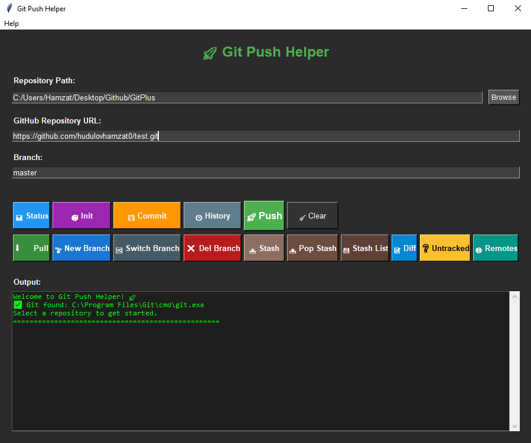

<h1 align="center"> <span style="color:#4CAF50;">Git Push Helper</span> </h1>

<p align="center">
  <b>A simple, user-friendly GUI to help you manage git repositories and push code to GitHub.</b><br>
  <i>Made with Python & Tkinter</i>
</p>

---

## ⚠️ Prerequisites

- <b>Python 3.8+</b> (Download: <a href="https://www.python.org/downloads/">python.org/downloads</a>)
- <b>Git for Windows</b> (Download: <a href="https://git-scm.com/download/win">git-scm.com/download/win</a>)  
  <span style="color:red;">❗ You MUST install Git for this app to work! It sends commands to the Git executable.</span>

---

## 🛠️ Installation

1. **Clone the repository:**
   ```bash
   git clone https://github.com/hudulovhamzat0/GitPlus.git
   cd GitPlus
   ```

2. **Install requirements:**  
   Tkinter is included with most Python installations.

3. **Run the app:**
   ```bash
   python main.py
   ```

4. **Build as EXE (Windows):**
   ```powershell
   pip install pyinstaller
   python -m PyInstaller --noconsole --onefile main.py --icon=icon.ico
   ```
   The executable will be in the `dist` folder.

---

## 🖥️ How to Install Git

- Go to <a href="https://git-scm.com/download/win">https://git-scm.com/download/win</a>
- Download and run the installer.
- Follow the setup instructions (default options are fine for most users).
- After installation, you can use this app!

---

## 🎯 Features

- <b>Status</b>: View the current git status of your repository.
- <b>Init</b>: Initialize a new git repository.
- <b>Add & Commit</b>: Stage all changes and commit with a custom message.
- <b>Push</b>: Push your branch to a remote GitHub repository.
- <b>Pull</b>: Pull the latest changes from the remote.
- <b>Branch Management</b>: Create, switch, and delete branches.
- <b>Stash</b>: Stash changes, apply stashes, and view stash list.
- <b>Diff</b>: View file differences.
- <b>Untracked Files</b>: List untracked files.
- <b>Remotes</b>: View remote repositories.
- <b>Commit History</b>: See the last 10 commits with notes and dates.
- <b>Output Terminal</b>: Read-only output area for all git command results.
- <b>Tooltips</b>: Helpful tooltips for all buttons.
- <b>Status Bar</b>: Quick status messages at the bottom.
- <b>Settings Persistence</b>: Remembers your last repo, branch, and remote.
- <b>About Dialog</b>: Info about the app and author.

---

## 📸 Screenshots




---

## Usage

- Select your local repository folder.
- Enter your remote GitHub URL and branch name.
- Use the buttons to perform git operations.
- See results in the output terminal.

---

## 📦 Download

**Latest Windows EXE:**  
👉 [Releases & Download EXE](https://github.com/hudulovhamzat0/GitPlus/releases) 👈

---

## 👤 Author

**Hamzat Hudulov**  
GitHub: [hudulovhamzat0](https://github.com/hudulovhamzat0)  
Email: hudulov@tuta.io

---

## 📄 License

MIT License (see [LICENSE](LICENSE) file for details)

---

## 🤝 Contributing

Pull requests and suggestions are welcome!

---

## 🐞 Issues

If you encounter any problems, please open an issue on GitHub.

---

<h3 align="center" style="color:#4CAF50;">Happy Coding! 🚀</h3>
